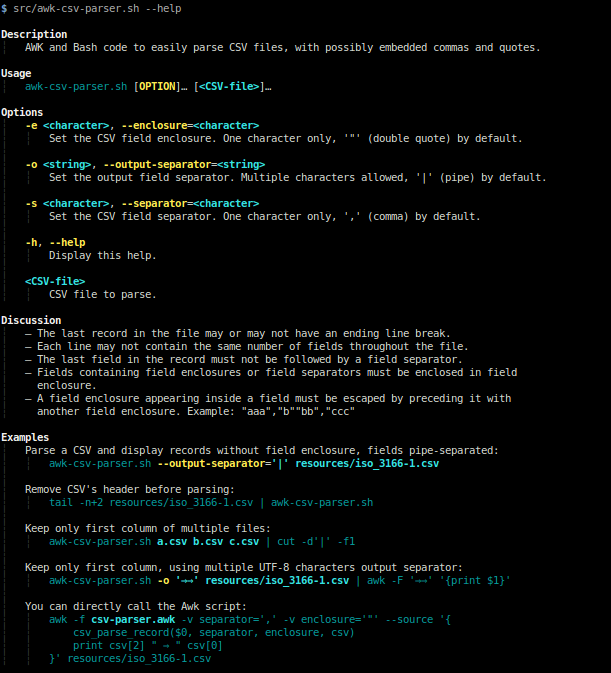

# Awk CSV parser

[](https://packagist.org/packages/geoffroy-aubry/awk-csv-parser)
[](http://travis-ci.org/geoffroy-aubry/awk-csv-parser)

AWK and Bash code to easily parse CSV files, with possibly embedded commas and quotes.

## Table of Contents

  * [Features](#features)
    * [Known limitations](#known-limitations)
    * [Links](#links)
  * [Requirements](#requirements)
  * [Usage](#usage)
  * [Examples](#examples)
  * [Installation](#installation)
  * [Copyrights & licensing](#copyrights--licensing)
  * [Change log](#change-log)
  * [Continuous integration](#continuous-integration)
  * [Git branching model](#git-branching-model)

## Features

  * Parse CSV files with only Bash and Awk.
  * Allow to process CSV data with standard UNIX shell commands.
  * Properly handle CSV data that contain field separators (commas by default)
    and field enclosures (double quotes by default) inside enclosed data fields.
  * Process CSVs from stdin pipe as well as from multiple command line file arguments.
  * Handle any character both for field separator and field enclosure.
  * Can rewrite CSV records with a multi-character output field separator, CSV enclosure characters removed
    and escaped enclosures unescaped.
  * Each line may not contain the same number of fields throughout the file.

### Known limitations

  * Does not **yet** handle embedded newlines inside data fields.

### Links

  * [Wikipedia: Comma-separated values](http://en.wikipedia.org/wiki/Comma-separated_values)
  * [RFC 4180: Common Format and MIME Type for Comma-Separated Values (CSV) Files](http://tools.ietf.org/html/rfc4180)

Other Awk implementations:

  * [dbro/csvquote](https://github.com/dbro/csvquote)
  * [AWK CSV Parser](http://lorance.freeshell.org/csv/)

## Requirements

  - Bash v4 _(2009)_ and above
  - GNU [Awk](http://www.gnu.org/software/gawk/) 3.1+

Tested on Debian/Ubuntu Linux.

## Usage

Displayed by:

```bash
$ awk-csv-parser.sh --help
```



##### Text version

    Description
        AWK and Bash code to easily parse CSV files, with possibly embedded commas and quotes.

    Usage
        awk-csv-parser.sh [OPTION]… [<CSV-file>]…

    Options
        -e <character>, --enclosure=<character>
            Set the CSV field enclosure. One character only, '"' (double quote) by default.

        -o <string>, --output-separator=<string>
            Set the output field separator. Multiple characters allowed, '|' (pipe) by default.

        -s <character>, --separator=<character>
            Set the CSV field separator. One character only, ',' (comma) by default.

        -h, --help
            Display this help.

        <CSV-file>
            CSV file to parse.

    Discussion
        – The last record in the file may or may not have an ending line break.
        – Each line may not contain the same number of fields throughout the file.
        – The last field in the record must not be followed by a field separator.
        – Fields containing field enclosures or field separators must be enclosed in field
          enclosure.
        – A field enclosure appearing inside a field must be escaped by preceding it with
          another field enclosure. Example: "aaa","b""bb","ccc"

    Examples
        Parse a CSV and display records without field enclosure, fields pipe-separated:
            awk-csv-parser.sh --output-separator='|' resources/iso_3166-1.csv

        Remove CSV's header before parsing:
            tail -n+2 resources/iso_3166-1.csv | awk-csv-parser.sh

        Keep only first column of multiple files:
            awk-csv-parser.sh a.csv b.csv c.csv | cut -d'|' -f1

        Keep only first column, using multiple UTF-8 characters output separator:
            awk-csv-parser.sh -o '⇒⇒' resources/iso_3166-1.csv | awk -F '⇒⇒' '{print $1}'

        You can directly call the Awk script:
            awk -f csv-parser.awk -v separator=',' -v enclosure='"' --source '{
                csv_parse_record($0, separator, enclosure, csv)
                print csv[2] " ⇒ " csv[0]
            }' resources/iso_3166-1.csv

## Examples

Excerpt from `resources/iso_3166-1.csv` ([full version](resources/iso_3166-1.csv)):

```csv
Country or Area Name,ISO ALPHA-2 Code,ISO ALPHA-3 Code,ISO Numeric Code
Brazil,BR,BRA,076
British Virgin Islands,VG,VGB,092
British Indian Ocean Territory,IO,IOT,086
Brunei Darussalam,BN,BRN,096
Burkina Faso,BF,BFA,854
"Hong Kong, Special Administrative Region of China",HK,HKG,344
"Macao, Special Administrative Region of China",MO,MAC,446
Christmas Island,CX,CXR,162
Cocos (Keeling) Islands,CC,CCK,166
```

##### 1. Parse a CSV and display records without field enclosure, output fields pipe-separated

```bash
$ awk-csv-parser.sh --output-separator='|' resources/iso_3166-1.csv | head -n10
# or:
$ cat resources/iso_3166-1.csv | awk-csv-parser.sh --output-separator='|' | head -n10
```

Result:

```csv
Country or Area Name|ISO ALPHA-2 Code|ISO ALPHA-3 Code|ISO Numeric Code|
Brazil|BR|BRA|076|
British Virgin Islands|VG|VGB|092|
British Indian Ocean Territory|IO|IOT|086|
Brunei Darussalam|BN|BRN|096|
Burkina Faso|BF|BFA|854|
Hong Kong, Special Administrative Region of China|HK|HKG|344|
Macao, Special Administrative Region of China|MO|MAC|446|
Christmas Island|CX|CXR|162|
Cocos (Keeling) Islands|CC|CCK|166|
```

##### 2. Remove CSV header, keep only first column and grep fields containing separator

```bash
$ tail -n+2 resources/iso_3166-1.csv | awk-csv-parser.sh | cut -d'|' -f1 | grep ,
```

Result:

```
Hong Kong, Special Administrative Region of China
Macao, Special Administrative Region of China
Congo, Democratic Republic of the
Iran, Islamic Republic of
Korea, Democratic People's Republic of
Korea, Republic of
Micronesia, Federated States of
Taiwan, Republic of China
Tanzania, United Republic of
```

##### 3. You can directly call the Awk script

```bash
$ awk -f csv-parser.awk -v separator=',' -v enclosure='"' --source '{
    csv_parse_record($0, separator, enclosure, csv)
    print csv[2] " ⇒ " csv[0]
}' resources/iso_3166-1.csv | head -n10
```

Result:

```
ISO ALPHA-3 Code ⇒ Country or Area Name
BRA ⇒ Brazil
VGB ⇒ British Virgin Islands
IOT ⇒ British Indian Ocean Territory
BRN ⇒ Brunei Darussalam
BFA ⇒ Burkina Faso
HKG ⇒ Hong Kong, Special Administrative Region of China
MAC ⇒ Macao, Special Administrative Region of China
CXR ⇒ Christmas Island
CCK ⇒ Cocos (Keeling) Islands
```

##### 4. Technical example

Content of `tests/resources/ok.csv`:

```csv
,,
a, b,c , d ,e e
"","a","a,",",a",",,"
"a""b","""","c"""""
```

Test:

```bash
$ awk-csv-parser.sh tests/resources/ok.csv
```

Result:

```
|| |
a| b|c | d |e e|
|a|a,|,a|,,|
a"b|"|c""|
```

##### 5. Errors

Content of `tests/resources/invalid.csv`:

```csv
"
"a,
a"
"a"b
```

Test:

```bash
$ awk-csv-parser.sh tests/resources/invalid.csv
```

Result:

```
[CSV ERROR: 3] Missing closing quote after '' in following record: '"'
[CSV ERROR: 3] Missing closing quote after 'a,' in following record: '"a,'
[CSV ERROR: 1] Missing opening quote before 'a' in following record: 'a"'
[CSV ERROR: 2] Missing separator after 'a' in following record: '"a"b'
```

## Installation

1. Move to the directory where you wish to store the source.

2. Clone the repository:
```bash
$ git clone https://github.com/geoffroy-aubry/awk-csv-parser.git
```

3. You should be on `stable` branch. If not, switch your clone to that branch:
```bash
$ cd awk-csv-parser && git checkout stable
```

4. You can create a symlink to `awk-csv-parser.sh`:
```bash
$ sudo ln -s /path/to/src/awk-csv-parser.sh /usr/local/bin/awk-csv-parser
```

5. It's ready for use:
```bash
$ awk-csv-parser
```

## Copyrights & licensing

Licensed under the GNU Lesser General Public License v3 (LGPL version 3).
See [LICENSE](LICENSE) file for details.

## Change log

See [CHANGELOG](CHANGELOG.md) file for details.

## Continuous integration

[](http://travis-ci.org/geoffroy-aubry/awk-csv-parser)

Launch unit tests:

```bash
$ tests/all-tests.sh
```

## Git branching model

The git branching model used for development is the one described and assisted
by `twgit` tool: [https://github.com/Twenga/twgit](https://github.com/Twenga/twgit).
